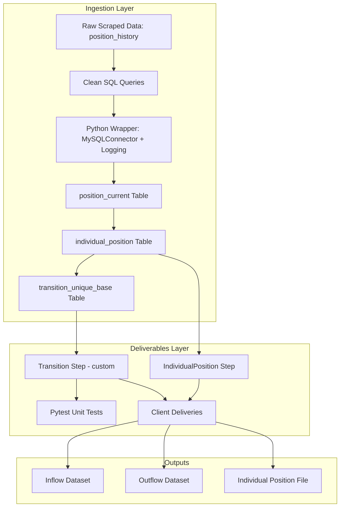

Over the past couple of weeks, I’ve been working on a production-style ETL pipeline that delivers cleaned, structured labor market data tailored to client specifications.

This project took all of my skills in infra, database administration, platform design and implementation, and data analytics, and made me re-imagine how these skills can be applied to understanding business concepts like labor market dynamics.

👀 I have some exciting expansions planned for the pipeline, too! I’m now extending it with new datasets, dashboards, and Airflow orchestration to make it fully end-to-end.

If you’re interested in how data engineering can turn messy scraped data into structured labor insights, check out the repo: [TalentFlow Repo](https://github.com/holland-reece/talentflow-etl/tree/main)

## 🧠 What it does:
 TalentFlow processes scraped LinkedIn jobs data — transforming it from raw ingestion into clean, client-ready deliverables that reveal insights about labor market movements.

### The pipeline:
- Cleans and restructures scraped profile data using SQL
- Automates transformations with a Python wrapper built on mysql-connector
- Implements a custom “Transition” step to model job changes between companies
- Includes unit tests and a modular design for reproducibility

## 🧰 Tech Stack
| Layer                  | Tools / Technologies                   |
| ---------------------- | -------------------------------------- |
| Data Storage           | MySQL                                  |
| Transformation         | SQL, Python (MySQL Connector)          |
| Delivery Automation    | Python, Object-Oriented Step Framework |
| Testing                | Pytest                                 |
| Environment Management | Conda, pip                             |
| Version Control        | GitHub                                 |
| Layer                   | Tools / Technologies                  |
| Visualization (planned) | Dash / Plotly                         |
| Orchestration (planned) | Apache Airflow                        |

## 🏗️ Project Architecture
The pipeline is divided into __two main stages__:

### Part 1: Ingestion Layer
| Output Table                                      | Description |
|---------------------------------------------------| ----------- |
| `position_current` | Latest positions per user derived from historical scrape data.        | 
| `individual_position` | Enriched position data joined with standardized location and company IDs.
| `transition_unique_base` | User-level job transitions with “previous” and “new” position details.

__Key transformations are written in SQL and/or Python (MySQL connector), focusing on:__
- Deduplication of scrape histories
- Temporal filtering to identify current jobs
- Standardization via lookup joins
- Construction of transition mappings between positions

### Part 2: Deliverables Layer
Implements an __automated data delivery system__ built with a modular “step” framework that executes standardized transformations and exports client datasets.  

__Deliverables include:__
- __`IndividualPosition` step__ → Delivers filtered position data by company
- __`Transition` step (custom implementation)__ → Produces inflow and outflow datasets describing movement into and out of target companies

Each step is independently configurable via client configuration files and can be orchestrated with command-line arguments for __production-style runs__.

## 💡 Design Highlights
- Modular and reproducible ETL design
- SQL-based data modeling for transparency
- Python orchestration for automation and flexibility
- Clean separation between raw, base, and deliverable layers
- Comprehensive environment management and testing

## 📈 Future Extensions
✅ Add new data sources (e.g., Glassdoor, Indeed)  
✅ Integrate interactive dashboards for labor market trends  
✅ Implement Airflow orchestration for DAG-based automation  
✅ Extend data validation and logging