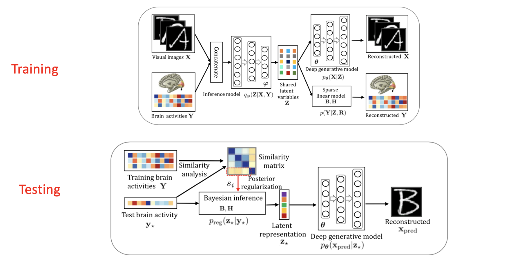

# Data Science Portfolio
## Evaluation and Validation: Selecting the Right Tools and Models to Solve Data Science Problems
**As a computational research assistant and in machine learning courses, I used validation methods and my knowledge of published academic work to find and test new computational methods and open-source tools.**

- Building on several published open-source image analysis tools, I developed a [preprocessing pipeline](https://github.com/holland-reece/SE-fMRI-Pipeline-magnitude-fieldmaps) for human brain imaging data, incorporating machine learning-based denoising tools to best suit my team's dataset and understand how different clinical populations' brain scans change over time.

- In a machine learning course, I compared [lasso and ridge regression techniques](https://github.com/holland-reece/ridge-vs-lasso-reg) using k-fold cross validation and forward feature selection using a publicly available dataset. I used area under the ROC curve and confusion matrices to understand the performance of each model.

```python
# Use ROC curve to test best threshold for lambda
fpr, tpr, thresholds = metrics.roc_curve(y_test, pred, pos_label=1)
print(f"False Positive Rates (Specificity): {fpr}\nTrue Positive Rates (Sensitivity): {tpr}\nThresholds: {thresholds}\n")
print(f"Area Under ROC Curve: {roc_auc_score(y_test, prob[:,1], multi_class='ovr')}\n")

# Based on the area under the ROC curve in this example, the optimal value for lambda = 1.
     
# Plot confusion matrix to visualize model performance on test set
cm = metrics.confusion_matrix(y_test, pred)
plt.figure(figsize=(5,5))
plt.imshow(cm, interpolation='nearest', cmap='BuGn')
plt.title('Confusion matrix', size = 15)
plt.colorbar()
tick_marks = np.arange(2)
plt.xticks(tick_marks, ["0", "1"], rotation=45, size = 10)
plt.yticks(tick_marks, ["0", "1"], size = 10)
plt.tight_layout()
plt.ylabel('Actual label', size = 15)
plt.xlabel('Predicted label', size = 15)
width, height = cm.shape

for x in range(width):
    for y in range(height):
        plt.annotate(str(cm[x][y]), xy=(y, x), horizontalalignment='center', verticalalignment='center')
plt.savefig(f'confusionmat.png')
```

<br>

---

## Big Data: Retreiving, Preprocessing, and Analyzing High-Dimensional Multimodal Data
**I have worked with large multimodal datasets spanning brain images, natural language in audio and text formats, videos of colonoscopies, EEG recording time series, and Swedish population health records. Here are a few examples showcasing my versatility as a data scientist.**

- As a data analysis research assistant in Stockholm, Sweden, I wrote scripts to retreive, organize and analyze health records from the Swedish Population Registry to identify predictors of responsiveness to psychiatric treatments.
**_(Language: R, Data structure: data trees in XML files, Primary method: mixed-effects linear regression for repeated measures)_**

- I provided a consult in a cross-institutional collaboration and applied my experience with human health data to develop analysis scripts (in Python) for a study in zebrafish larvae.
**_(Languages: Python and Matlab, Data structure: videos in TIFF files)_**
> Velez-Angel, 2024, [*bioRxiv*](https://doi.org/10.1101/2025.02.07.637118)

- In a cross-functional team of psychiatrists, psychologists and engineers, I helped adapt and train an open-source variational autoencoder deep learning model to better understand visual processing in people with schizophrenia. Using brain scans as input, the model created feature maps it used to reconstruct photographs study participants viewed during the brain scan.
**_(Languages: Python and Matlab, Data structure: 3D brain scans in NIfTI files, numpy arrays and pandas dataframes)_**



- Fitting deep learning models on the MNIST publicly available dataset (ML master's course project)
    - I demonstrate [tuning model parameters](https://github.com/holland-reece/neural-network-fitting-demo) (number and type of network layers, number of epochs, learning rate and type of optimizer) to fit a neural network, then evaluate and compare model performance.
**_(Languages: Python, Data structure: numpy arrays and pandas dataframes)_**

```python
model.summary()

# define loss function
loss_fn = tf.keras.losses.CategoricalCrossentropy(
    from_logits=True, name='categorical_crossentropy')

# define optimizer,loss function and evaluation metric
optimizer = tf.keras.optimizers.Adam(lr = 0.1) # change learning rate
model.compile(optimizer=optimizer,
             loss=loss_fn,
             metrics=['accuracy'])

# train the model
model.fit(x_train_small, y_train_small_onehot,epochs=5)

# evaluate model
y_test_onehot = to_categorical(y_test)
model.evaluate(x_test,y_test_onehot,verbose=2)
```

### I choose the best model for a dataset, fit it, fine-tune it, and validate it to solve data science problems effectively and efficiently.


