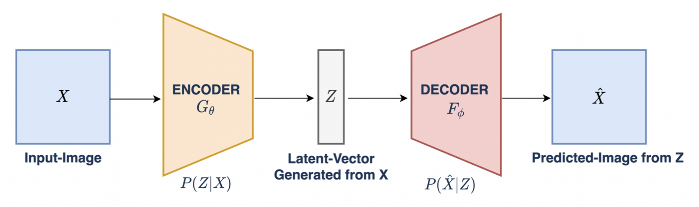

# Research Skills
## Analyzing high-dimensional, multi-modal data in healthcare and clinical research
- As a computational research assistant, I analyzed high-dimensional datasets of brain images, cognitive tests and psychiatric evaluations to inform therapeutic development for psychiatric disorders.

- Building on code developed by other research groups, I developed a [preprocessing pipeline](https://github.com/holland-reece/SE-fMRI-Pipeline-magnitude-fieldmaps) for human brain imaging data, incorporating machine learning-based denoising tools to clarify images and understand how different clinical populations' brain scans change over time.

- In a cross-institutional colaboration, I applied my experience with human health data to develop analysis scripts for a study in zebrafish larvae.
> Velez-Angel, 2024, [*bioRxiv*](https://doi.org/10.1101/2025.02.07.637118)
<br>

---

## Cutting-edge deep learning techniques for creative solutions to research problems
- In a cross-functional team, I helped train a variational autoencoder deep learning model to better understand visual processing in people with schizophrenia. Using brain images as input, the model created feature maps it used to reconstruct photographs study participants viewed during the brain scan.



## Applying explainable AI methods to publicly available datasets
- Demonstration: fitting deep learning models on the MNIST publicly available dataset
    - Changing the number of network layers or epochs, or using a different optimizer such as Adam, are all methods to better fit a network to a dataset.
```
model_tiny.summary()

loss_fn = tf.keras.losses.CategoricalCrossentropy(
    from_logits=True, name='categorical_crossentropy')

# define optimizer,loss function and evaluation metric
optimizer = tf.keras.optimizers.Adam(lr = 0.1) # change learning rate
model_tiny.compile(optimizer=optimizer,
             loss=loss_fn,
             metrics=['accuracy'])

# train the model
model_tiny.fit(x_train_small, y_train_small_onehot,epochs=5)

# evaluate model
y_test_onehot = to_categorical(y_test)
model_tiny.evaluate(x_test,y_test_onehot,verbose=2)
```

### I apply my experience with a wide range of machine learning methods to efficiently select the best model for a research question, fit the model to a dataset and provide actionable insights.

- Comparison of [lasso and ridge regression techniques](https://github.com/holland-reece/ridge-vs-lasso-reg) using k-fold cross validation and forward feature selection

- Classification of MNIST data using a [logistic regression classifier](https://github.com/holland-reece/logreg-classifier-MNIST-demo)
